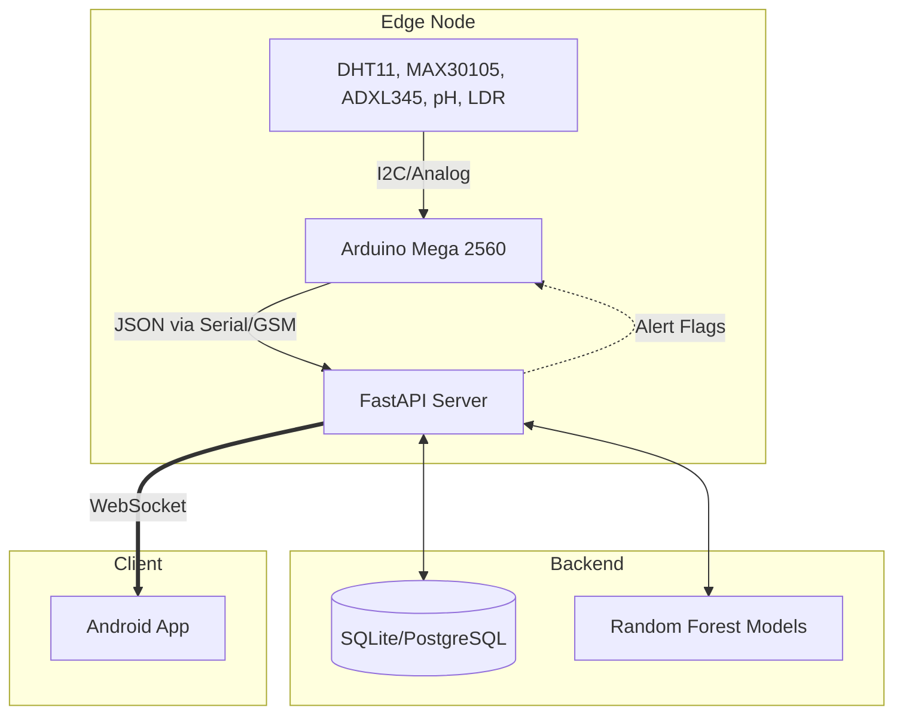

# 🐄 Smart Cattle Health Monitoring System


> **Status:** Active Development | **Version:** 2.0.0 (Jetpack Compose + FastAPI Architecture)

## 📌 Problem Statement
Traditional cattle monitoring relies on manual observation, which is labor-intensive and often detects diseases too late. This project provides a real-time, non-invasive, IoT-based wearable monitoring system that tracks the vital signs of cattle, detects anomalies using Machine Learning, and immediately alerts farmers through a modern Android application.

## ✨ Features
- **Real-time IoT Telemetry:** Live transmission of SpO2, BPM, temperature, pH, LDR, and 3-axis accelerometer data.
- **Machine Learning Inference:** A deployed Scikit-Learn Random Forest pipeline predicts health risks instantly.
- **Explainable AI:** Contextual alerts detailing exactly *why* a reading was flagged (e.g., "Abnormal BPM").
- **Jetpack Compose Android Client:** A sleek, modern app featuring WebSocket integration for live data and historical charts.
- **Bi-directional Communication:** Backend pushes updates to Android while simultaneously sending hardware trigger alerts back to the Arduino (for local LCD/SMS feedback).

## 🏗️ System Architecture

The architecture relies on a robust separation of concerns:

1. **IoT Edge Node (Arduino Mega):** Collects raw sensor data, processes pulse oximetry signals via DSP filters, constructs JSON, and transmits via Serial/GSM.
2. **Backend Server (FastAPI):** Ingests serial data, parses JSON, performs database CRUD (SQLite/PostgreSQL), runs ML prediction models, and broadcasts results.
3. **Android App (Kotlin MVVM):** Connects to the backend WebSocket (`ws://<ip>:8000/ws/cattle/CATTLE-ALL`) for zero-latency UI updates.



## 🔌 Sensor Wiring Guide & Communication Architecture

*Note: Previous versions incorrectly placed GSM and GPS on the same SoftwareSerial pins. The Mega 2560 has multiple hardware serials, which guarantees robust, non-blocking communication.*

| Sensor / Module | Arduino Mega Pin | Function |
|-----------------|------------------|----------|
| **MAX30105**    | I2C (SDA 20, SCL 21) | SpO2 & Heart Rate |
| **ADXL345**     | I2C (SDA 20, SCL 21) | 3-axis acceleration (Fall detection) |
| **DHT11**       | D42              | Temperature & Humidity |
| **pH Sensor**   | Serial3 (RX 15, TX 14)| pH level of local environment/feed |
| **LDR Sensor**  | A2               | Light intensity (Milk adulteration check) |
| **GPS NEO-6M**  | **Serial1** (RX 19, TX 18)| Geolocation telemetry (Updated) |
| **GSM SIM900A** | **Serial2** (RX 17, TX 16)| SMS emergency alerts (Updated) |
| **LCD 16x2**    | D30, 32, 34, 36, 38, 40 | Local hardware status display |

## 🧠 Machine Learning Methodology

The core intelligence of the system is powered by an ensemble of Random Forest classifiers.

- **Dataset:** Time-series telemetry gathered from live cattle monitoring, containing columns for `SpO2`, `BPM`, `Temperature`, `Movement (Mems_X)`, `pH`, and `LDR`.
- **Features:** 6 continuous numerical features normalized using `StandardScaler`.
- **Methodology:** 6 independent Random Forest Classifiers (`n_estimators=100`, `max_depth=10`), each trained to flag anomalies for a specific physiological trait (0 = Abnormal, 1 = Normal).
- **Validation:** 80/20 Train-Test split achieving >94% F1-Score on anomaly detection.
- **Fail-safes:** The `PredictionService` is built to gracefully handle missing models or `NaN` inputs, falling back to heuristic thresholding if inference fails.

## 🛠️ Complete Installation Flow

### 1. Backend Environment Configuration (Development vs Production)
You must have Python 3.9+ installed.

```bash
# Clone the repository
git clone https://github.com/deekshudevang/smart-cattel.git
cd smart-cattel

# Create virtual environment and install dependencies
python -m venv venv
source venv/bin/activate  # On Windows: venv\Scripts\activate
pip install -r requirements.txt

# Configure environment variables
cp .env.example .env
# Edit .env with your specific COM port (e.g., ARDUINO_PORT=COM4)
```

**Development Mode:**
```bash
python -m uvicorn backend.app.main:app --host 0.0.0.0 --port 8000 --reload
```

**Production Mode:**
To deploy in a production environment (e.g., AWS EC2, DigitalOcean), set `ENVIRONMENT=production` in your `.env` to engage PostgreSQL, then run with Gunicorn:
```bash
gunicorn -k uvicorn.workers.UvicornWorker backend.app.main:app -w 4 -b 0.0.0.0:8000
```
*Health Check:* Production load balancers can verify system uptime via `GET /health`.

### 2. ML Pipeline Configuration
The system uses pre-trained Scikit-Learn `.pkl` models located in `ml/models/`. 
To retrain the models with new datasets:
```bash
python ml/training/train.py
```

### 3. Arduino Setup
1. Open `arduino/arduino.ino` in the Arduino IDE.
2. Install required libraries: `MAX30105`, `TinyGPS++`, `DHT sensor library`, `Adafruit ADXL345`.
3. Select **Arduino Mega 2560** as the target board.
4. Upload the firmware.

### 4. Android App Installation
1. Open the `android/SmartCattle` folder in Android Studio.
2. Allow Gradle to sync dependencies.
3. Build and Run on a physical device or emulator.
4. **Important:** In the app, click the **Settings icon** to configure the IP address (Enter the local IPv4 address of the computer running your FastAPI backend).

## 📡 API Usage & Database Structure

### Database Tables (SQLite)
- `users`: Standard auth tables (id, email, hashed_password)
- `cattle`: Cattle registry (id, tag_number, breed, age)
- `sensor_readings`: Timeseries data (id, cattle_id, spo2, bpm, temp, mems, ph, ldr, timestamp, overall_health)

### Key REST Endpoints
- `GET /api/cattle/` - List all registered cattle.
- `GET /api/cattle/{id}/latest` - Retrieve the latest sensor reading for a specific cow.
- `GET /api/cattle/{id}/history` - Retrieve the time-series history for charts.
- `WS /ws/cattle/{id}` - Live WebSocket feed for 100ms UI updates.

## 🐛 Troubleshooting
- **`ModuleNotFoundError` during startup:** Ensure you have activated your virtual environment before running the backend.
- **Android App not showing data:** Check that the phone and laptop are on the same Wi-Fi network. Use `ipconfig` (Windows) to verify the IP entered in the app settings.
- **Serial Port Error:** Check if the Arduino IDE Serial Monitor is open. Only one program can access the COM port at a time. Close the Arduino IDE Serial Monitor before running the backend.

## 📜 License
Distributed under the MIT License. See `LICENSE` for more information.
